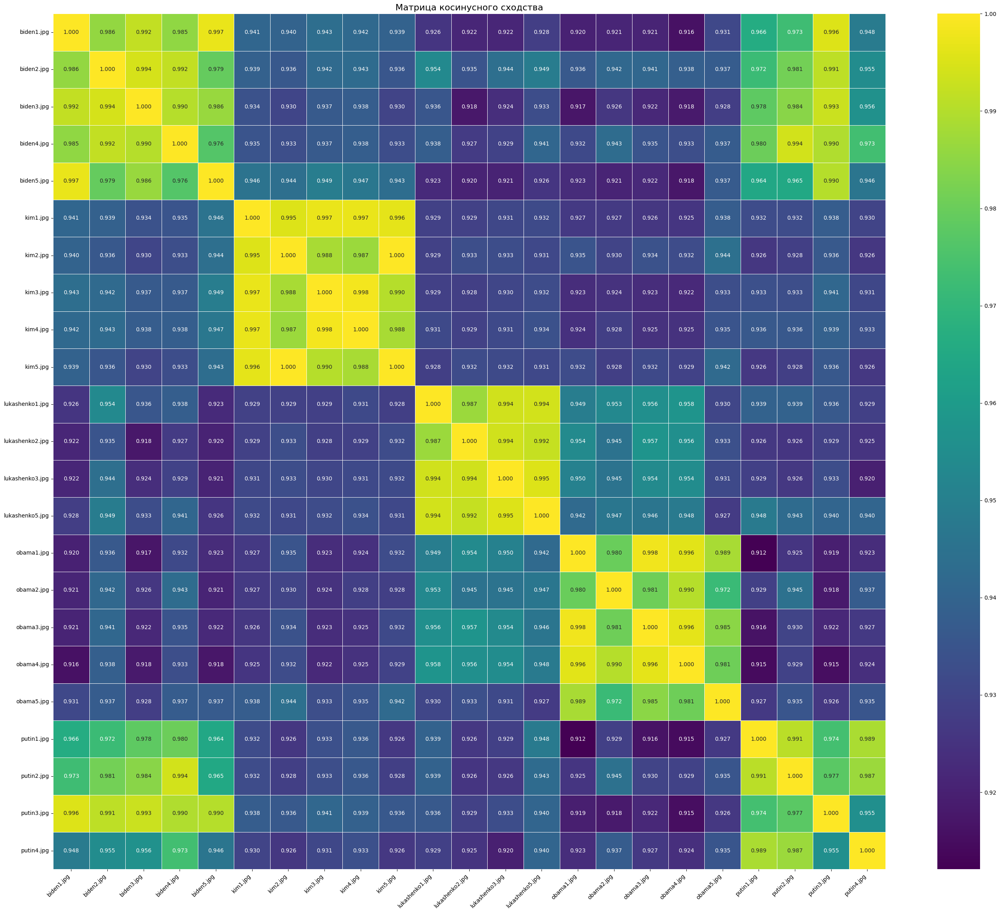

# Deep Learning School (семестр 1, весна 2025) - Итоговый проект

# Структура проекта

* models.py - архитектура StackedHourglass, создание модели для FaceRecognition
* 1FaceAlignment.ipynb - модель "выравнивания" - поиск глаз, носа, рта
* defenitions.py - arcface loss + положения точек на лице
* create_aligned_data.py - скрипт который создает выравненные и приближенные лица, для обучения face recognition модели
* 2_ArcFace.ipynb - ArcFace loss, resnet как backbone
* 2_dop_Triplet_Loss.ipynb - доп задания 2 и 3 - обучение на TripletLoss и смеси с ArcFace
* pipeline.ipynb - блокнот с детекцией лиц (предобученная модель), alignment, recognition. Есть возможность сравнивать конкретные три файла, есть возможность сравнивать все файлы которые находятся в папке ./test_images
* requirements.txt - возможно не полные

* sketches/face_alignment_accelerate_train.py - использование accelerate для первой задачи

* /models - файлы обученных моделей
* /data - данные для обучения
* /data/celeba - данные для обучения aligment модели (загрузка через pytorch, либо если gdown ошибка то можно вручную архив загрузить)
* /data/celeba_aligned_top_n - результат работы скрипта create_aligned_data.py - папки, названия которых числа (айди человека, одна папка - один человек)

* 0FaceRecognitionBase - формулировка задания, без кода

## Процесс обучения 

### Face alignment 

Это блокнот 1FaceAlignment.ipynb. Он скачивает датасет (хотя иногда могут быть проблемы, в ошибке будет ссылка на гугл диск, там можно скачать вручную файлы и положить их в папку). Датасет celeba, 5 ключевых точек - глаза, рот и нос. 
Модель StackedHourglass определена в файле models.py. Учим её находить пять ключевых точек на лице. 
Сначала я пробовал учить в несколько заходов, каждый раз уменьшая размер пятна у heatmap. Это пользы никакой не принесло. 
Потом у меня получилось обучить за 30 эпох, с размером хитмапа (сигма) 2, lr 1e-3, батч 32, 16 каналов в слоях, на полном датасете. На это ушло 12 часов. А потом этот чекпоинт я случайно перезаписал. Пришлось учить еще раз. При обучении модель начинает работать достаточно неожиданно: если на прошлой эпохе все точки были мимо, то на следующей уже могут все попадать.
Сейчас там нет логов обучения, но пример того что оно работает есть. Единственное, что оно плохо работает на необычных картинках. Например черно-белые картинки очень его путают. Можно решить через аугментации. 
Рабочая модель сохранена в models/working_aligner.pth

### Face Recognition

Это большой этап из нескольких частей. Сначала подготовка данных для обучения. Нужно использовать aligner модель, чтобы приблизить и выровнять лица из датасета. 
Для этого сделал скрипт create_aligned_data.py - там в начале нужно задать сколько нужно картинок. Данные он создает в папке data, с названием celeba_aligned_top_n где n это сколько людей было задано. Он берет всех людей, сортирует их по количеству фото, берет top_n у которых больше всего фоток. Кроме папки с данными создается еще папка debug, где можно посмотреть как распознаются ключевые точки на оригинальном изображении. 
Эталонные точки, к которым переносятся ключевые точки, заданы в defenitions.py

#### Архитектура

Для всех моделей распознавания используется backbone resnet34 предобученный, с заменой последнего слоя. Функция получения этой модели находится в models.py. 
Resnet34 выбрал потому что 18 слишком маленький. 34 возможно тоже маловат, но есть проблема:

Обучение хоть и запускается, но идет медленно. Я не сильно разбираюсь в железе, как я понял, это потому что nvidia маловато cuda cores положили. 
Использовать colab казалось не очень приятным из-за большого датасета который пришлось бы загружать на диск. Также я уже вынес по разным файлам скрипты подготовки данных, архитектуры моделей. 
Поэтому решил терпеть дальше на этом железе. Также у меня windows, из-за чего в блокнотах не работали num_workers у загрузчиков данных. Поэтому при обучении в блокноте видеокарта нагружалась только на 50-70, а иногда и 30 процентов.
В какой-то момент я смог использовать сервер с двумя 4090 для обучения, где смог комфортно обучить модель aligner. В папке sketches есть скрипт который использует accelerate для этого, но полностью разобраться я не успел. В блокноте accelerate работать отказывался. 
Ближе к концу я все-таки вынес код обучения на ArcLoss в отдельный файл, чтобы использовать num_workers и за несколько заходов все таки обучить одну качественную модель, которая реально распознает лица. 

Обучение на CE и ArcLoss в блокноте 2_ArcFace.ipynb

#### Cross Entropy

Первая идея при обучении. Просто классификация на много классов. Но с этим есть проблемы. Непонятно как адаптироваться к новым классам которых не было при обучении, то есть новым людям. Последний слой становится гигантским если много людей. Эмбеддинги предпоследнего слоя не оптимальные.
Зато очень просто. 
Надежды сделать хорошо тут мало, поэтому учил только на 200 классах. Учил два раза по 15 эпох, с lr 1e-3, 1e-4. В следующих заданиях научился пользоваться шедулером CosineAnnealingLR. 75% accuracy набирает быстро, в основном потому что мало классов я думаю. Но учить на большем количестве людей я не успею. 

#### ArcLoss

Учим модель распихивать эмбеддинги разных людей на гиперсфере. Где разные люди в разных кластерах. Определение функции в файле defenitions.py
На тех же 200 классах accuracy уже 80%. 
Но для нормальной работы пайплайна нужна модель которая действительно что-то из себя представляет. Для её обучения есть файл serious_train.py. В нем используется ArcLoss для обучения все той же модели, но датасет уже десять тысяч человек, а не 200, есть функция частых сохранений прогресса, с возможностью продолжить с той же точки. 

#### Pipeline

В блокноте pipeline.ipynb реализован пайплайн. Загружаются модели alignment, recognition. Также загружается модель детекции - MTCNN. Для этого задания можно использовать сторонние библиотеки. 
В этом блокноте два примера использования. В первом мы загружаем три картинки. На них детектятся лица, чуть-чуть отдаляются (чтобы похоже было на то что при обучении), детектятся ключевые точки, лицо выравнивается, пропускается через face_recognition модель, сравниваются косинусные эмбеддинги. По умолчанию порог похожести 0.95. 
Но когда хочешь проверить качество модели становится очень лень сидеть и попарно рассматривать что там распозналось. Поэтому второй способ. Складываем лица людей в папку test_images. Желательно, чтобы одинаковые люди были при сортировке по алфавиту вместе, то есть названия файлов одинаковых людей должны начинаться одинаково. Для всей пачки людей запускаются все этапы. В итоге строится матрица схожести. Если люди отсортированы, то на матрице мы увидим красивые прямоугольнички:

Эти прямоугольнички это одинаковые люди, и наглядно видно что модель работает хорошо. 
Но:
1. Она сейчас путает Путина и Байдена. Они в целом похожи немного да. (Может если поучить подольше, станет получше)
2. Данные такие, что люди друг на друга там не похожи, так что это не сложный случай. 
3. Да, я скучный, я взял мировых лидеров, потому что кто-то в беседе так тоже сделал. (сначала я проверял на своих товарищах, но подумал что они не обрадуются, если я их фотки без разрешения в интернет выложу)

### Доп задания

#### Identification Rate Metric

Если учили с помощью cross entropy loss, то мы не можем оценить точность на новых людях. Для этого придумали Identification Rate Metric. С ее помощью можем оценить как хорошо модель отличает людей которых никогда не видела. 
Я взял людей которых точно нет в обучающей выборке. 200 человек будем искать, 1000 человек будут отвлекать. Дальше считаем косинусные схожести. 
* Человека с собой же из query
* Человека с другими из query
* Человека со всеми из отвлекающих 
Дальше берем второй и третий список, сортируем по схожести. 
Задаем уровень терпимой ошибки, сколько процентов ошибок мы готовы стерпеть. Находим порог схожести, который соответствует этому порогу ошибки. (в сортированном негативном списке, на индексе, который соответствует терпимой ошибке, будет значение равное нашему порогу схожести)
Смотрим, сколько настоящих пар имеет схожесть выше этого порога. Это и будет наша метрика TPR. 
У меня метрики получились достаточно плохие, потому что я мало обучал на CE loss, только на 200 человек. 

#### Triplet loss

Берем три картинки - две одного человека и другой на третьей. Заставляем модель делать так, чтобы расстояние между одним и тем же человеком было маленькое, а с другим большое. Для этого нужно собирать специальные батчи, в которых несколько фото одного человека. 
Чтобы ускорить обучение, можно выбирать в батче сложные пары, людей которых она плохо отличает. 
Accuracy считаем через knn.
На чистом triplet loss обучается нестабильно. 
Также можно смешивать Triplet loss с ArcFace loss. Просто считаем оба лосса и складываем с некоторым весом. 

Чат жпт сказал что оптимальный подход будет сначала научиться на ArcFace loss, затем только учиться на triplet loss. 

#### Ресерч

В задании нужно было провести исследование по существующим библиотекам для задачи распознавания лиц. Результаты исследования находятся в папке opensource_research. 

### Итого

На все задание ушло около двух недель. Но это обычно выглядело как: небольшое изменение -> ожидание, пока обучится. 
Я думаю, можно было бы сделать быстрее, если бы с самого начала обучать в .py файле, чтобы использовать num_workers>0. 